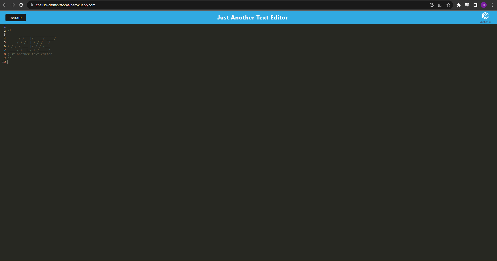

# PWA Challenge 19                        

## Description

This application is a simple text editor that is run off a single page application. It allows the user to create whatever they want using this progressive web application! This PWA saves the users data in the browser, so they can come back to it later and continue where they left off. This application also works offline, so the user can use it anywhere they want!
## Table of Contents

- [Description](#description)
- [Installation](#installation)
- [Usage](#usage)
- [License](#license)
- [Contributing](#contributing)
- [Tests](#tests)
- [Questions](#questions)

## Installation

To install this applcation, simply go to the [Heroku Link](https://chall19-dfd8c2ff224a.herokuapp.com/) and click the `install` button at the top of the screen!

## Usage

The usage for this applcation is simple. Once the user has installed the application, they can use it like any other text editor. If the user does not want to install the application, simply go to the [Heroku Link](https://chall19-dfd8c2ff224a.herokuapp.com/) and begin using the text editor for whatever they desire! As previously stated, the user can also use this application offline, so they can use it anywhere they want!

## License

MIT

## Contributing

Gustavo Diaz

## Tests

## Questions

For more information, visit my GitHub profile: [diazgus411](https://github.com/diazgus411/PWA)

Deplyed Heroku Link: [Click Here!](https://chall19-dfd8c2ff224a.herokuapp.com/)

To contact me, send an email to: "diazgus411@gmail.com"